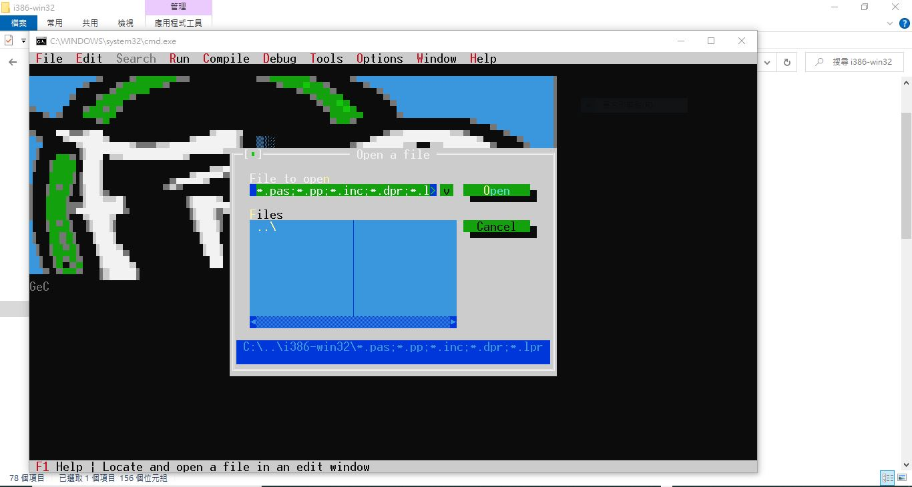

# Free-Pascal-Win10-CHT-IDE-no-show
Free Pascal was no show in Win 10, why and how to resolve

something was odd,
https://github.com/xiaolaba/Free-Pascal-UTF8-supported

something was even more oddy,
Another PC installed but no Free Pascal IDE show up.

try this,
go to C:\FPC\3.2.2\bin\i386-win32
created run.bat

```
::code page of utf-8
::chcp 65001

::code page of microsoft windows Chinese Tradiotional 950
::chcp 950

::code page of OEM US 437
chcp 437

fp.exe
```

click run.bat to invoke Free Pascal with specific code page, result is good,   

